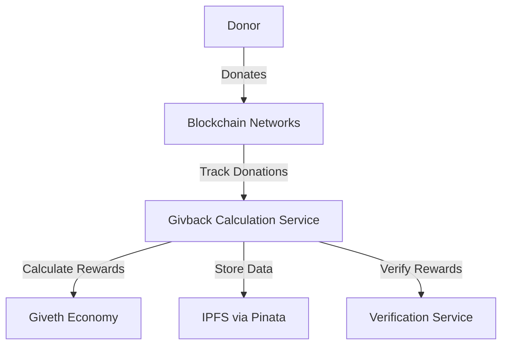

# Givback Calculation Service

> **Reference version — March 2026 (v5-only).** This branch was reverted to
> commit [`97024da`](https://github.com/Giveth/givback-calculation/commit/97024da2811513f18aec3231db506d0ec6e17257)
> (`Merge pull request #71 — Ensure Cause donation data sent to GIVbacks is of
> origin tx information`, 2025-11-12), which is the last commit before the
> April/May 2026 changes that attempted to add v6 donations. All v6-related
> work (PRs #72, #74, #75, #76) has been removed from this branch. The v6 work
> remains available on the original feature branches
> (`issue-264-v6-donations-calculate-api`, `issue-323-givbacks-round-export`)
> as a starting point for the new combined v5/v6 GIVbacks system. See
> [Giveth/giveth-dapps-v2#5569](https://github.com/Giveth/giveth-dapps-v2/issues/5569)
> for context.

## 1. Project Overview

### Purpose
The Givback Calculation Service is a backend service that calculates GIV tokens to be distributed to donors based on their donations. It integrates with various blockchain networks and services to track donations and calculate rewards.

### Key Features
- Calculates GIV token rewards for donors
- Integrates with multiple blockchain networks (Mainnet, xDai, Polygon zkEVM)
- Supports multiple donation tracking methods
- Provides API endpoints for reward calculation and verification
- Integrates with Giveth.io and Giveth Economy subgraph

### Live Links
- Production: https://givback.giveth.io
- Staging: https://givback-staging.giveth.io

## 2. Architecture Overview

### System Diagram


### Tech Stack
- TypeScript/Node.js
- Express.js
- Ethers.js
- Uniswap V3 SDK
- GraphQL
- Docker
- IPFS (via Pinata)

### Data Flow
1. Donations are tracked across multiple blockchain networks
2. Service calculates GIV rewards based on donation amounts and conditions
3. Rewards are verified and stored
4. Data is made available through API endpoints

## 3. Getting Started

### Prerequisites
- Node.js (v14 or higher)
- Docker and Docker Compose
- Access to blockchain nodes (Mainnet, xDai, Polygon zkEVM)
- Pinata API credentials

### Installation Steps
1. Clone the repository:
```bash
git clone https://github.com/giveth/givback-calculation.git
cd givback-calculation
```

2. Install dependencies:
```bash
npm install
```

3. Copy environment file:
```bash
cp .env.example .env
```

4. Configure environment variables in `.env`

### Configuration
Required environment variables:
- `GIVETHIO_BASE_URL`: Giveth.io API base URL
- `TRACE_BASE_URL`: Feathers API base URL
- `MAINNET_NODE_URL`: Ethereum Mainnet node URL
- `ZKEVM_NODE_HTTP_URL`: Polygon zkEVM node URL
- `XDAI_NODE_HTTP_URL`: xDai node URL
- `PINATA_API_KEY`: Pinata API key
- `PINATA_SECRET_API_KEY`: Pinata secret API key
- `GIV_ECONOMY_SUBGRAPH_URL`: Giveth Economy subgraph URL
- `REFERRAL_SHARE_PERCENTAGE`: Referral share percentage

## 4. Usage Instructions

### Running the Application
Development mode:
```bash
npm start
```

Production mode:
```bash
docker-compose -f docker-compose-production.yml up -d
```

### Testing
Currently, the project does not have automated tests set up. Manual testing can be done through the API endpoints.

### Common Tasks
- Calculate rewards for a specific donation
- Verify reward calculations
- Update reward distribution parameters

## 5. Deployment Process

### Environments
- Production: Deployed on production servers
- Staging: Deployed on staging servers for testing

### Deployment Steps
1. Build the Docker image:
```bash
docker build -t ghcr.io/giveth/givback-calculation:latest .
```

2. Deploy using Docker Compose:
```bash
docker-compose -f docker-compose-production.yml up -d
```

### CI/CD Integration
The project uses GitHub Actions for CI/CD. Deployment is automated through the GitHub workflow.

## 6. Troubleshooting

### Common Issues
1. Connection issues with blockchain nodes
   - Solution: Verify node URLs and network connectivity

2. API rate limiting
   - Solution: Implement rate limiting and retry mechanisms

3. Reward calculation discrepancies
   - Solution: Verify input parameters and calculation logic

### Logs and Debugging
- Access logs through Docker:
```bash
docker-compose -f docker-compose-production.yml logs -f
```

- Enable debug mode by setting appropriate environment variables

## License
This project is licensed under the ISC License - see the [LICENSE](LICENSE) file for details.
